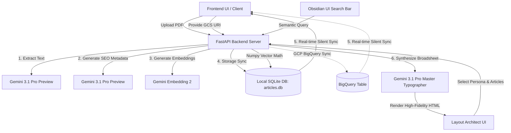

# NewsLens AI
### Devanagari Article Extraction & Semantic Intelligence Portal

**NewsLens AI** is a premium, responsive web application and backend service that transforms standard Devanagari (Hindi) daily newspaper PDFs into highly structured articles, enriches them with AI-generated SEO metadata (summaries, keywords, and categories), and enables concept-based semantic search.

It is built on top of the workflow illustrated in [Article_extraction.ipynb](file:///usr/local/google/home/sjangbahadur/news_paper_demo/Article_extraction.ipynb), leveraging **Gemini 3.1 Pro** for structured extraction and **Gemini Embedding 2** for vector representation.

---

## 🏛️ Architectural Workflow



1. **Multi-Modal Ingestion**: A PDF page or complete newspaper sheet is ingested via the frontend either through local file drag-and-drop or by specifying a direct Google Cloud Storage (GCS) bucket URI (`gs://...`).
2. **Devanagari Extraction**: Gemini 3.1 Pro reads the PDF layout vertically (retaining column flow) and extracts every news story exactly as it appears (zero hallucination) into standard JSON.
3. **SEO Metadata Enrichment**: Each extracted article body is analyzed to generate:
   - A concise **AI news summary** (in Devanagari Hindi).
   - A high-CTR search engine **meta description**.
   - An optimized **Primary Keyword** and relevant **Secondary Keywords**.
   - Category classifications (**Tags**).
4. **Embedding Generation**: The AI summary text is translated into a 768-dimensional coordinate vector utilizing the `gemini-embedding-2` model.
5. **Hybrid Storage & Real-Time Sync**: Article records, metadata, and float embeddings are stored locally in a SQLite database (`articles.db`), and optionally synchronized to a Google BigQuery cloud table. The frontend UI silently polls and synchronizes with the active database in the background to keep the dashboard feed live and up-to-date.
6. **Semantic Concept Search**: Users type search queries (in Hindi or English). The query is embedded, and a fast Python-based cosine similarity check is performed locally across all stored articles to instantly return the best conceptual matches, complete with match percentage indicators.
7. **AI Layout Architect (Synthesis & Typography)**: Users switch to the Layout Architect view, select a target reader persona (e.g., Millennial Digest, Traditional Daily, Financial Chronicle, Sensational Tabloid) and a checklist of processed articles. Gemini 3.1 Pro acts as an Executive Chief Editor and Master Typographer to dynamically synthesize, format, and copyfit the selected stories into a responsive, standalone high-fidelity HTML newspaper broadsheet layout ready for print or export.

---

## ✨ Key Features

* ** obsidian-dark Aesthetic**: A curated premium UI utilizing translucent glassmorphism backdrops, vibrant colored neon gradients, Outfit/Inter Google Fonts, custom styled scrollbars, and glowing focal accents.
* **Multi-Modal Ingestion Pipeline**: An interactive animated timeline tracking stage progress for both local PDF uploads and direct Google Cloud Storage (GCS) bucket paths.
* **Real-Time Feed Synchronization**: Automatic background polling ensuring the client dashboard stays perfectly in sync with newly processed articles from SQLite or BigQuery without requiring manual page refreshes.
* **AI Layout Architect**: Generates fully customized, responsive HTML newspaper front pages tailored to specific reader personas (Millennial Digest, Traditional Daily, Financial Chronicle, Sensational Tabloid) using advanced copyfitting and modular grid geometry.
* **Semantic Querying**: Understands concept queries (e.g. searching *"शादी की तैयारी कैसे करें"* matching with Wedding Trends resource articles).
* **Detailed Info overlays**: Clean details modal displaying the full news story, Dateline/Reporter, Page numbers, and optimized SEO insights side panels.
* **Hybrid Database Fallback**: Instantly runs locally on SQLite without GCP credential dependencies, while maintaining full BigQuery synchronization capability.

---

## 🚀 Setup & Deployment Instructions

### 💻 Local Development

#### 1. Prerequisites
- **Python 3.13+** installed.
- Re-authenticate your local Google Cloud SDK credentials to avoid API token errors:
  ```bash
  gcloud auth login
  gcloud auth application-default login
  ```

#### 2. Install Python Dependencies
From the workspace directory, install the required Python libraries:
```bash
python3 -m pip install --user --break-system-packages -r requirements.txt
```
*Note: `--break-system-packages` is used to bypass Debian PEP 668 environment lock on direct system Python environments safely.*

#### 3. Launch the Application
Start the uvicorn development server:
```bash
python3 -m uvicorn main:app --host 127.0.0.1 --port 8080 --reload
```

Once launched, open your web browser and navigate to:
👉 **[http://127.0.0.1:8080](http://127.0.0.1:8080)**

---

### ☁️ Google Cloud Run Deployment

You can deploy the portal as a secure, fully managed serverless container on Google Cloud Run using the provided automated deployment assistant.

#### 1. Authenticate with Google Cloud SDK
Ensure the Google Cloud CLI (`gcloud`) is installed, authenticate your account, and configure your active project:
```bash
gcloud auth login
gcloud config set project <YOUR_GCP_PROJECT_ID>
```

#### 2. Execute Deployment Assistant
Run the automated deployment script from the root directory:
```bash
bash deploy.sh
```

The deployment assistant will automatically:
1. Verify your active `gcloud` authentication and target GCP project.
2. Build and tag the Docker container image via **Google Cloud Build**.
3. Deploy the container to **Google Cloud Run** with all required runtime environment variables configured.
4. Output the live HTTPS URL to access your deployed web application.

---

## 📂 File Structure

- `main.py`: FastAPI server orchestrating endpoints and serving the static client interface.
- `requirements.txt`: Required Python packages (FastAPI, GenAI SDK, NumPy, Scikit-Learn, etc.).
- `Dockerfile`: Container specification for Google Cloud Run deployment.
- `deploy.sh`: Automated Google Cloud Run deployment assistant script.
- `services/gemini_service.py`: Vertex AI client wrapper for Gemini Pro and Embedding calls.
- `services/db_service.py`: SQLite database connector and vector similarity orchestrator.
- `frontend/index.html`: Modern Devanagari interface page structure.
- `frontend/style.css`: Premium dark-mode glassmorphism styling rules.
- `frontend/app.js`: Vanilla event-driven JavaScript controlling view state changes and API fetches.
